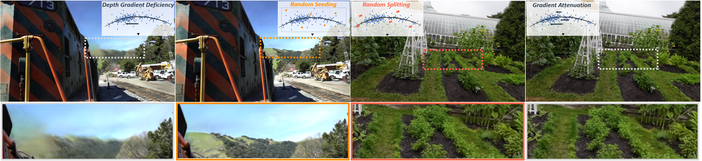

<div align="center">
  <h1 align="center">Exploration Matters for Escaping the Blur Trap in 3D Gaussian Splatting</h1>
  
  <p align="center">
    <a href="https://arxiv.org/pdf/2607.17965" target="_blank" rel="noopener noreferrer"></a>
    <a href="https://arxiv.org/abs/2607.17965"></a>
    <a href="https://chengbo-wang.github.io/ExploreGS/"></a>
  </p>

  <p align="center">
    <a href="https://chengbo-wang.github.io/"><strong>Chengbo Wang</strong></a>
    ·
    <a href="https://guozheng-ma.github.io/"><strong>Guozheng Ma</strong></a>
    ·
    <a href="https://github.com/Chengbo-Wang/ExploreGS"><strong>Jinhong Wu</strong></a>
    ·
    <a href="https://github.com/Chengbo-Wang/ExploreGS"><strong>Tie Ji</strong></a>
    ·
    <a href="https://yizhenlao.github.io/"><strong>Yizhen Lao</strong></a>
  </p>

  </div>


Official implementation of [Exploration Matters for Escaping the Blur Trap in 3D Gaussian Splatting](https://chengbo-wang.github.io/ExploreGS/).

## 💻Overview



<font color='#dd0000'>**We identify the Blur Trap as a fundamental limitation intrinsic to 3DGS, rooted in an inherent exploitation-only optimization bias.** </font> It manifests as two variants: the Far-Side Blur Trap triggered by depth-gradient deficiency and the Near-Side Blur Trap driven by 2D-gradient attenuation. To break this deadlock, we introduce minimal exploration operators: Random Seeding and Random Splitting. These straightforward interventions bypass gradient-dependent optimization, consistently recovering structural details and proving that simple explicit exploration is highly effective for escaping the Blur Trap without complex modifications.


## 🔧 Environment Setup

Create a conda environment with Python 3.12:

```bash
# Create and activate environment
conda create -n Explore4GS python=3.12
conda activate Explore4GS

# Install PyTorch (with CUDA support, choose version for your CUDA)
# See: https://pytorch.org/get-started/previous-versions/
pip install torch==2.10.0 torchvision==0.25.0 torchaudio==2.10.0 --index-url https://download.pytorch.org/whl/cu128

# Install other dependencies
pip install plyfile tqdm opencv-python joblib

# Install submodules
pip install submodules/diff-gaussian-rasterization --no-build-isolation
pip install submodules/simple-knn --no-build-isolation
pip install submodules/fused-ssim --no-build-isolation
```

## 🗒️Checklist

- [ ] Release Exploration Code for `3DGS`
- [ ] Release Exploration Code for `gsplat`
